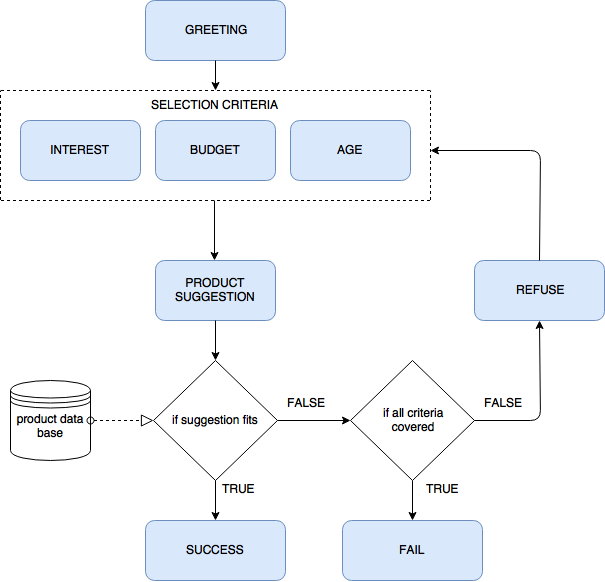

# Sales Training Bot

## To get this to work

1. Clone this repo.

    ```
	    git clone https://git.lohika.com/nlp/chatbot01.git
    ```
    
2. You need the original ChatScript code to build the chatbot. Execute the .sh file to download CS from Sourceforge.
    
    ```
	    cd chatbot01/ChatScript/
	    sh getChatScript.sh
    ```
    
    If you want to push changes from this repo, all the original ChatScript files needed to build the bot will be ignored.
    
3. To run the bot locally from the ChatScript directory:
    
    **Windows**
    
    ```
	    BINARIES/ChatScript
    ```
    
    **Linux**
    
    ```
	    BINARIES/LinuxChatScript64 local
    ```
    
    Note: to set the file executable: `chmod a+x ./LinuxChatScript64`
    
    **MacOS**
    
    ```
	    BINARIES/MacChatScript local
    ```
    
4. Once you've run CS locally, build the bot:
    
    ```
	    :build <bot name>
    ```
    
    For example:
    
    ```
	    :build sales
    ```
    
    Note: If the conversation isn't starting from the beginning, reset it:
    
    ```
	    :reset
    ```
    
    You can also reset a specific user if there were multiple conversations under different names:
    
    ```
	    :reset <user name>
    ```


For more features see the source: [github.com/bwilcox-1234/ChatScript](https://github.com/bwilcox-1234/ChatScript/)

## Current conversation outline

